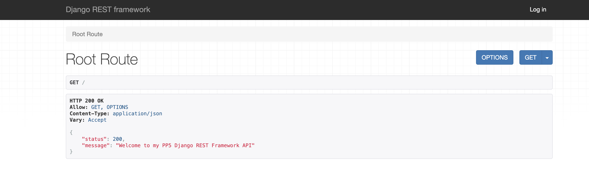
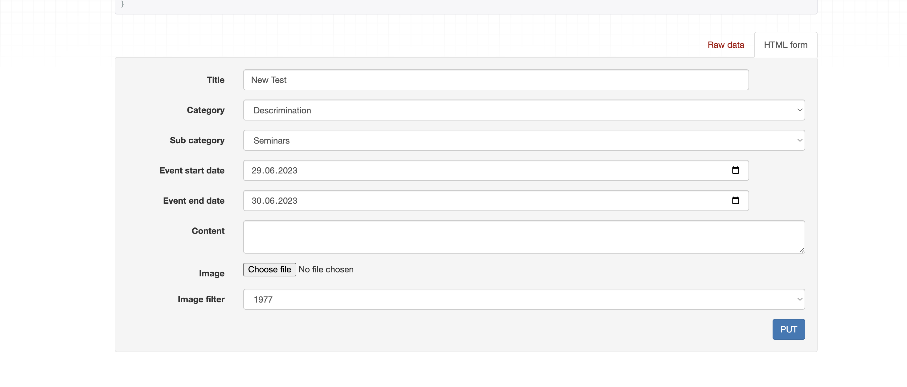

# **Humaitas Events PP5 API**

**Developer: Shubham Sinha**

💻 [Live link](https://pp5-api-ref.herokuapp.com/)

This repository contains the API set up using Django REST Framework for the Humanitas Events front-end application

## Table of Contents

- [Project Structure](#project-structure)
  - [Code Structure](#code-structure)
- [User Stories](#user-stories)
  - [Profiles](#profiles)
  - [Events](#events)
  - [Comments](#comments)
  - [Interested](#interested)
  - [Join](#join)
  - [Followers](#followers)
- [Technologies Used](#technologies-used)
- [Agile Design](#agile-design)
- [Database Design](#database-design)
  - [Models](#models)
    - [User Model](#user-model)
    - [Profile Model](#profile-model)
    - [Event Model](#event-model)
    - [Comment Model](#comment-model)
    - [Interested Model](#interested-model)
    - [Join Model](#join-model)
    - [Followers Model](#followers-model)
- [Features](#features)

## Project Structure

The overall structure of the project was made with the help of Code Institute walthrough project [drf-api](https://github.com/Code-Institute-Solutions/drf-api) including models, views and serializers.

### Code Structure

Project code structure is organized and divided into various application folders and constructed using Django Rest Framework

#### Project Apps

- **profile app**: This app contains model, views, serializers, tests and urls for profile
- **events app**: This app contains model, views, serializers, tests and urls for events
- **comments app**: This app contains model, views, serializers, tests and urls for comments
- **interested app**: This app contains model, views, serializers, tests and urls for interested
- **join app**: This app contains model, views, serializers, tests and urls for join
- **followers app**: This app contains model, views, serializers, tests and urls for followers

#### Other django apps

- **settings.py**: This file contains configuration settings for your Django project, such as database settings, installed apps, and middleware.
- **Procfile**: This file is used to specify the commands that should be executed when your Django app is deployed on a hosting platform.
- **requirements.txt**: This file lists the dependencies required for the Django project to run.
- **env.py**: This file is used to store environment variables for a Django project or application, such as database connection details or API keys.

## User Stories

### Profiles

1. As a site owner/developer I can view lists of profiles so that I can can see how many profiles has been created
2. As a site owner/developer I can view the details of a profile so that I can see individual profile data
3. As a site owner/developer I can update my profile so that I can change data when I want
4. As a site owner/developer I can delete profile so that I can delete profile which I don't want to continue with

### Events

5. As a site owner/developer I can view a list of all events so that I can see all events at once
6. As a site owner/developer I can view a single event so that I can view the detail of event including comment counts, interested_count and join_request
7. As a site owner/developer I can create an event so that I can share what events are upcoming
8. As a site owner/developer I can edit an event so that I can change the data with correct information
9. As a site owner/developer I can delete event so that I can remove the event not valid or cancelled

### Comments

10. As a site owner/developer I can view list of all comments so that I can see all comments for the events
11. As a site owner/developer I can retrieve a comment by its id so that I can edit/delete the comment
12. As a site owner/developer I can add comments to events so that I can interact with various people regarding an event
13. As a site owner/developer I can edit/update comment so that I can change what I have commented
14. As a site owner/developer I can delete comments on events so that I can delete unwanted comments or my written comments

### Interested

15. As a site owner/developer I can view the list of interested shown on events so that I can see all the interested created in the API for the events
16. As a site owner/developer I can retrieve interested by id so that I can be able to make changes to it
17. As a site owner/developer I can add interested functionality for events so that I can show interest for the event
18. As a site owner/developer I can delete interested functionality to event so that I can delete my interested instance if not interested anymore

### Join

19. As a site owner/developer I can view a list of join request for an event so that I can view how many request has been requested
20. As a site owner/developer I can retrieve join request so that I can make changes to it
21. As a site owner/developer I can create a join request for an event so that I can join an event
22. As a site owner/developer I can delete join request so that I can delete join request which is not approved anymore

### Followers

23. As a site owner/developer I can view a list of followers so that I can view who is following
24. As a site owner/ developer I can retrieve followers by id so that I can make changes to it
25. As a site owner/developer I can create follow so that I can follow another user
26. As a site owner/developer I can delete a follow so that I can unfollow another user

## Technologies Used

### Languages & Frameworks

- Python 3.10.2
- Django
- Django Rest Framework

### Libraries & Tools

- [Cloudinary](https://cloudinary.com/) to store images for profile and events
- [CI Python Linter](https://pep8ci.herokuapp.com/) was used for validation of python files.
- [Lucidcharts](https://lucid.app/) has been used in project to design and document data model architecture.
- [CodeAnyWhere](https://app.codeanywhere.com/) was IDE used for writing code and to push the code to GitHub
- [GitHub](https://github.com/) was used as a remote repository to store project code
- [Heroku](https://heroku.com) - Cloud platform. Justification: I used this was used to deploy the project into live environment
- [Django REST Framework](https://www.django-rest-framework.org/) - API toolkit. Justification: I used this to build the back-end API
- [Django AllAuth](https://django-allauth.readthedocs.io/en/latest/index.html) - API Module. Justification: I used this for user authentication
- [Psycopg2](https://www.psycopg.org/docs/) - PostgreSQL database adaptor. Justification: This was used as a PostgreSQL database adapter for Python
- [ElephantSQL](https://www.elephantsql.com/) - Database hosting service – Justification: This was used as the deployed project on Heroku uses an ElephantSQL database

### All libraries for deployment in Heroku

- All libraries is stored in requirements.txt for deployment in heroku

All libraries

##### Back to [top](#table-of-contents)

## Agile design

### About

- Agile development is the most effective way to development of any website
- This was my second attempt in agile development but I feel I made a tremendous improvement
- I was able to follow the steps and add milestones in this project

### User Story Template

- Using Github issues first I created the template for a user story that was later used to create user stories. I created four labels: must have, could have, should have.

See User story template

### Kanban Board

- As a visual representation of the project's status, showing what tasks are to be done, in progress and completed.Each task is represented as a card on the board, and the cards can be moved from one column to another to show progress.

[Link to project Kanban board.](https://github.com/users/Sinha5714/projects/6)

See Kanban board

### Moscow Prioritisation

- The Moscow prioritization technique is used to prioritize project requirements based on their importance.

See Image

### Milestones

- Milestones are created with a aim of finishing a task on a certain date. I have created 7 milestones for this project and linked them with issues related.

See Image

See Image

## Database Design

### Data Models

#### User Model

- User model as part of the Django Rest Framework dj-rest-auth library contains basic information about authenticated user and contains folowing fields:
  Username, Password, Email

#### Profile model

- Profile model is created for user to add their details and image for better interaction with the website

| Name           | Database Key   | Field Type    | Validation                                      |
| -------------- | -------------- | ------------- | ----------------------------------------------- |
| user           | user           | OneToOneField | User, on_delete=models.CASCADE                  |
| profile_pic    | profile_pic    | ImageField    | upload_to='images/', default='../avatar_zavejy' |
| name           | name           | CharField     | max_length=255 blank=True                       |
| about_me       | about_me       | TextField     | blank=True                                      |
| email          | email          | EmailField    | max_length=255 blank=True                       |
| instagram_link | instagram_link | URLField      | max_length=200 blank=True                       |
| facebook_link  | facebook_link  | URLField      | max_length=200 blank=True                       |
| phone_number   | phone_number   | IntegerField  | null=True blank=True                            |
| created_on     | created_on     | DateTimeField | auto_now_add=True                               |
| updated_on     | updated_on     | DateTimeField | auto_now_add=True                               |

#### Event model

- Event model is created for user to add events in the website
- Following categories choices were added for user to select for an event

  - EVENT_CATEGORIES = (
    ("Discrimination", "Descrimination"),
    ("LQBTQ", "LGBTQ"),
    ("Equal-Rights", "Equal Rights"),
    ("Marraige-Rights", "Marraige Rights"),
    ("Work-Rights", "Work Rights"),
    ("Education-Rights", "Education Rights"),
    )

  - EVENT_SUB_CATEGORIES = (
    ("Seminars", "Seminars"),
    ("Meet-ups", "Meet-ups"),
    ("Retreats", "Retreats"),
    )

- Following image filter choices were added for user to filter image

  - image_filter_choices = [
    ('_1977', '1977'), ('brannan', 'Brannan'),
    ('earlybird', 'Earlybird'), ('hudson', 'Hudson'),
    ('inkwell', 'Inkwell'), ('lofi', 'Lo-Fi'),
    ('kelvin', 'Kelvin'), ('normal', 'Normal'),
    ('nashville', 'Nashville'), ('rise', 'Rise'),
    ('toaster', 'Toaster'), ('valencia', 'Valencia'),
    ('walden', 'Walden'), ('xpro2', 'X-pro II')
    ]

| Name             | Database Key     | Field Type    | Validation                                                        |
| ---------------- | ---------------- | ------------- | ----------------------------------------------------------------- |
| user             | user             | ForeignKey    | User, on_delete=models.CASCADE                                    |
| title            | title            | CharField     | max-length=255                                                    |
| content          | content          | TextField     | max-length=255                                                    |
| image            | image            | ImageField    | upload_to='images/', default='../equal-rights_o1owqr', blank=True |
| image_filter     | image_filter     | CharField     | max_length=32, choices=image_filter_choices, default='Normal'     |
| event_start_date | event_start_date | DateTimeField | blank=True, null=True                                             |
| event_end_date   | event_end_date   | DateTimeField | blank=True, null=True                                             |
| category         | category         | CharField     | max_length=50, choices=EVENT_CATEGORIES, default='Equal-Rights'   |
| sub_category     | sub_category     | CharField     | max_length=50, choices=EVENT_SUB_CATEGORIES, default='Seminars'   |
|                  |
| created_on       | created_on       | DateTimeField | auto_now_add=True                                                 |
| updated_on       | updated_on       | DateTimeField | auto_now_add=True                                                 |

#### Comment model

- Comment model was created for user to comment on an event

| Name       | Database Key | Field Type    | Validation                      |
| ---------- | ------------ | ------------- | ------------------------------- |
| user       | user         | ForeignKey    | User, on_delete=models.CASCADE  |
| event      | event        | ForeignKey    | Event, on_delete=models.CASCADE |
| created_on | created_on   | DateTimeField | auto_now_add=True               |
| updated_on | updated_on   | DateTimeField | auto_now_add=True               |
| content    | content      | TextField     | blank=False                     |

#### Interested model

- Interested model was created for user to show interest for an event

| Name       | Database Key | Field Type    | Validation                                                 |
| ---------- | ------------ | ------------- | ---------------------------------------------------------- |
| user       | user         | ForeignKey    | User, on_delete=models.CASCADE                             |
| event      | event        | ForeignKey    | Event, related_name='interested', on_delete=models.CASCADE |
| created_on | created_on   | DateTimeField | auto_now_add=True                                          |

#### Join model

- Join model was created for user to send join request for an event

| Name       | Database Key | Field Type    | Validation                                           |
| ---------- | ------------ | ------------- | ---------------------------------------------------- |
| user       | user         | ForeignKey    | User, on_delete=models.CASCADE                       |
| event      | event        | ForeignKey    | Event, related_name='join', on_delete=models.CASCADE |
| created_on | created_on   | DateTimeField | auto_now_add=True                                    |

#### Followers model

- Join model was created for user to send join request for an event

| Name       | Database Key | Field Type    | Validation                                                |
| ---------- | ------------ | ------------- | --------------------------------------------------------- |
| user       | user         | ForeignKey    | User, on_delete=models.CASCADE , related_name='following' |
| followed   | followed     | ForeignKey    | User, on_delete=models.CASCADE ,related_name='followed'   |
| created_on | created_on   | DateTimeField | auto_now_add=True                                         |

## Features

### Home Page

- This is the welcoming page for all users
- Once user opens the API site, this page appears in front of him.

See API Site Homepage

- When user opens the deployed API site, this page appears in front of him.

See Deployed API Site Homepage

### Profile List Page

- This page consists of profile list of all users
- **User Story Covered**: 1

See Profile List Page

### Profile Detail Page

- This page consists of profile detail page
- If user is owner he can edit and delete his profile
- **User Story Covered**: 2, 3, 4

See Profile Detail Page

See Profile Owner Detail Page

### Event List Page

- This page consists of event list of all events which have been posted
- This page also consist a event create form for logged in user
- **User Story Covered**: 5, 7

See Event List Page

See Event List - Create Form 

### Event Detail Page

- This page consists of event detail
- If user is owner he can edit and delete his event what he has posted
- **User Story Covered**: 6, 8, 9

See Event Detail Page

See Event Owner Edit Form

### Comment List Page

- This page consists of comment list of all comments posted for events
- This page also consist a comment create form for logged in user with event options
- **User Story Covered**: 10, 12

See Comment List Page

See Comment List - Create Form 

### Comment Detail Page

- This page consists of comment detail
- If user is owner he can edit and delete his comments what he has posted
- **User Story Covered**: 11, 13, 14

See Comment Detail Page with Edit form

### Interested List Page

- This page consists of interested list of all interests shown for events
- This page also consist a interested create form for logged in user with event options
- If user want to show interest again a validation error is thrown
- **User Story Covered**: 15, 17

See Interested List Page with Create Form

See Interested List Page with Error

### Interested Detail Page

- This page consists of interested detail
- If user has shown interest he can delete his interest
- **User Story Covered**: 16, 18

See Interested Detail Page

### Join List Page

- This page consists of join list of all join request sent for events
- This page also consist a join create form for logged in user with event options
- If user want to send join request again a validation error is thrown
- **User Story Covered**: 19, 21

See Join List Page

See Join List Page with Error

### Join Detail Page

- This page consists of join detail
- If user has sent request he can delete his request
- **User Story Covered**: 20, 22

See Join Detail Page

### Followers List Page

- This page consists of followers list of all user following each other
- This page also consist a followers create form for logged in user with other users options
- If user want to follow a followed user again a validation error is thrown
- **User Story Covered**: 23, 25

See Follower List Page with Create Form

See Follower List Page with Error

### Followers Detail Page

- This page consists of followers detail
- If user has followed another user he can delete his follow
- **User Story Covered**: 24, 26

See Followers Detail Page

