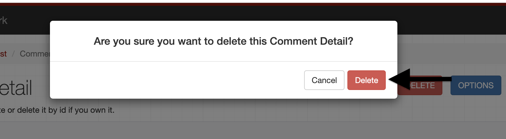

# TESTING

## Table of Contents

1. [Manual Testing](#manual-testing-of-user-stories)
2. [Automated Testing]()
3. [Bugs](#bugs)
4. [Unfixed Bugs](#unfixed-bugs)

### Manual testing of user stories

1. As a site owner/developer I can view lists of profiles so that I can can see how many profiles has been created

| **Step**                              | **Expected Result**             | **Actual Result** |
| ------------------------------------- | ------------------------------- | ----------------- |
| Add "/profiles" in deployed url       | profile list page opens         | Work as expected  |
| User scrolls through the profile list | profiles of users are displayed | Work as expected  |

Screenshot

2. As a site owner/developer I can view the details of a profile so that I can see individual profile data

| **Step**                           | **Expected Result**       | **Actual Result** |
| ---------------------------------- | ------------------------- | ----------------- |
| Add "/profiles/id" in deployed url | profile detail page loads | Work as expected  |

 

Screenshot

3. As a site owner/developer I can update my profile so that I can change data when I want

| **Step**                                                  | **Expected Result**                      | **Actual Result** |
| --------------------------------------------------------- | ---------------------------------------- | ----------------- |
| User log in                                               | logged in status is shown in top right   | Work as expected  |
| Add "/profiles/id" in deployed url (id of user's profile) | profile detail page loads with edit form | Work as expected  |
| User update the data and click on put                     | updated data is shown in profile list    | Work as expected  |

 

Screenshots

4. As a site owner/developer I can delete profile so that I can delete profile which I don't want to continue with

| **Step**                                                  | **Expected Result**                          | **Actual Result** |
| --------------------------------------------------------- | -------------------------------------------- | ----------------- |
| User log in                                               | logged in status is shown in top right       | Work as expected  |
| Add "/profiles/id" in deployed url (id of user's profile) | profile detail page loads with delete button | Work as expected  |
| User clicks on delete button                              | a modal confirming delete occurs             | Work as expected  |
| User clicks on delete button                              | profile is deleted                           | Work as expected  |

 

Screenshots

5. As a site owner/developer I can view a list of all events so that I can see all events at once

| **Step**                             | **Expected Result**    | **Actual Result** |
| ------------------------------------ | ---------------------- | ----------------- |
| Add "/events" in deployed url        | events list page opens | Work as expected  |
| User scrolls through the events list | events are displayed   | Work as expected  |

Screenshots

6. As a site owner/developer I can view a single event so that I can view the detail of event including comment counts, interested_count and join_request

| **Step**                         | **Expected Result**      | **Actual Result** |
| -------------------------------- | ------------------------ | ----------------- |
| Add "/events/id" in deployed url | events detail page loads | Work as expected  |

 

Screenshot

7. As a site owner/developer I can create an event so that I can share what events are upcoming

| **Step**                            | **Expected Result**                      | **Actual Result** |
| ----------------------------------- | ---------------------------------------- | ----------------- |
| User log in                         | logged in status is shown in top right   | Work as expected  |
| Add "/events" in deployed url       | events lists page loads with create form | Work as expected  |
| User add the data and click on post | new event is shown in events list        | Work as expected  |

Screenshot

8. As a site owner/developer I can edit an event so that I can change the data with correct information

| **Step**                                              | **Expected Result**                    | **Actual Result** |
| ----------------------------------------------------- | -------------------------------------- | ----------------- |
| User log in                                           | logged in status is shown in top right | Work as expected  |
| Add "/events/id" in deployed url (id of user's event) | event detail page loads with edit form | Work as expected  |
| User update the data and click on put                 | updated data is shown in events list   | Work as expected  |

Screenshot

9. As a site owner/developer I can delete event so that I can remove the event not valid or cancelled

| **Step**                                              | **Expected Result**                        | **Actual Result** |
| ----------------------------------------------------- | ------------------------------------------ | ----------------- |
| User log in                                           | logged in status is shown in top right     | Work as expected  |
| Add "/events/id" in deployed url (id of user's event) | event detail page loads with delete button | Work as expected  |
| User clicks on delete button                          | a modal confirming delete occurs           | Work as expected  |
| User clicks on delete button                          | event is deleted                           | Work as expected  |

Screenshot

10. As a site owner/developer I can view list of all comments so that I can see all comments for the events

| **Step**                               | **Expected Result**      | **Actual Result** |
| -------------------------------------- | ------------------------ | ----------------- |
| Add "/comments" in deployed url        | comments list page opens | Work as expected  |
| User scrolls through the comments list | comments are displayed   | Work as expected  |

Screenshot

11. As a site owner/developer I can retrieve a comment by its id so that I can edit/delete the comment

| **Step**                           | **Expected Result**       | **Actual Result** |
| ---------------------------------- | ------------------------- | ----------------- |
| Add "/comments/id" in deployed url | comment detail page loads | Work as expected  |

Screenshot

12. As a site owner/developer I can add comments to events so that I can interact with various people regarding an event

| **Step**                            | **Expected Result**                       | **Actual Result** |
| ----------------------------------- | ----------------------------------------- | ----------------- |
| User log in                         | logged in status is shown in top right    | Work as expected  |
| Add "/comments" in deployed url     | comment lists page loads with create form | Work as expected  |
| User add the data and click on post | comment is shown in comments list         | Work as expected  |

Screenshot

13. As a site owner/developer I can edit/update comment so that I can change what I have commented

| **Step**                                                  | **Expected Result**                      | **Actual Result** |
| --------------------------------------------------------- | ---------------------------------------- | ----------------- |
| User log in                                               | logged in status is shown in top right   | Work as expected  |
| Add "/comments/id" in deployed url (id of user's comment) | comment detail page loads with edit form | Work as expected  |
| User update the data and click on put                     | updated data is shown in comments list   | Work as expected  |

Screenshots

14. As a site owner/developer I can delete comments on events so that I can delete unwanted comments or my written comments

| **Step**                                                  | **Expected Result**                          | **Actual Result** |
| --------------------------------------------------------- | -------------------------------------------- | ----------------- |
| User log in                                               | logged in status is shown in top right       | Work as expected  |
| Add "/comments/id" in deployed url (id of user's comment) | comment detail page loads with delete button | Work as expected  |
| User clicks on delete button                              | a modal confirming delete occurs             | Work as expected  |
| User clicks on delete button                              | comment is deleted                           | Work as expected  |

Screenshots

## Bugs

### CI Python Linter

- No bug was found during Python Validation

### Heroku Deployment

- No error found during deployment

## Unfixed Bugs

- No unfixed bugs from developer side
